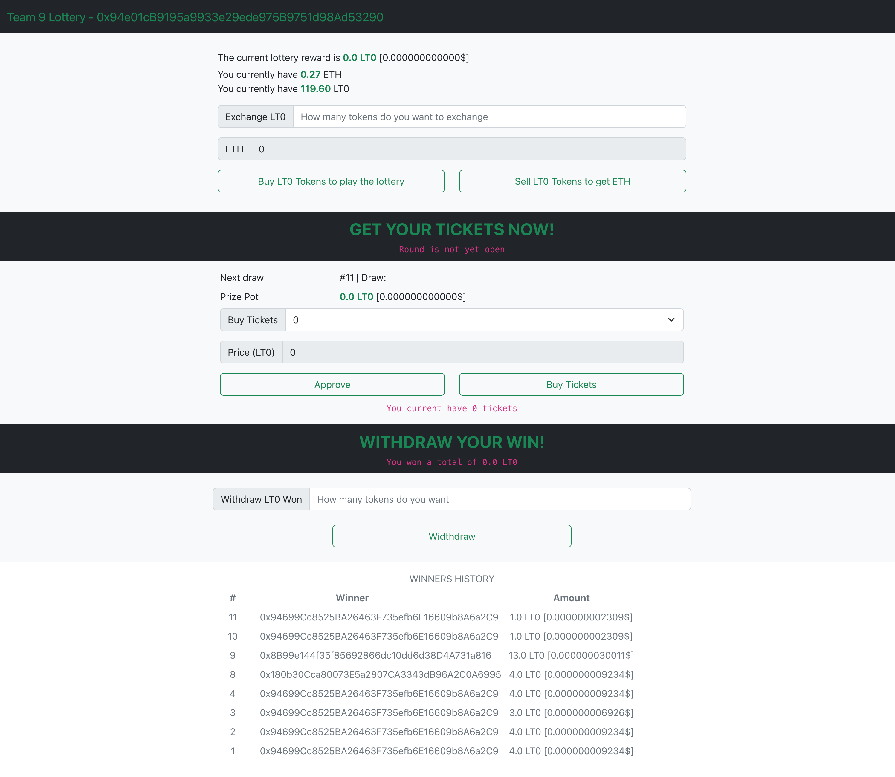

# Encode Solidity Bootcamp - Team 9 - Week#5

## Instructions

- Build a frontend for the Lottery dApp
- Use any framework of your preference
- Create a wallet by importing the private key or mnemonic
- (Bonus) implement metamask wallet connection

## Basic information

Lottery contract address: `0x94e01cB9195a9933e29ede975B9751d98Ad53290`

## Solution description

### Components

Our solution is composed of following components:

- Frontend application

Application is written in React and is responsible for interacting with the end users. It implements the lottery worklow and integrates with Metamask wallet

- Web wallet (Metamask)

A crypto wallet which serves as a secure gateway for users to interact with the blockchain. Our frontend application initiates the transactions and wallet provides an interface for users to commit them to the blockchain.

- Lottery smart contract

Smart contract deployed to the blockchain which implements lottery system.

- LotteryToken smart contract

Smart contract deployed to the blockchain which implements lottery token.

- Interaction script

Utility script which implements commonly used functions - deploying the contracts, interacting with lottery contract etc...

### Application description

Application consists of multiple sections. It is structured in a way to guide a user through the process of participating in the lottery.

**User info**

This section shows number of tokens user has and enables him to buy tokens or return them and get eth back.

**Lottery info**

Shows current state of the lottery - if it is open or closed, how much time is left unti draw and what round it is.
It also enables user to approve tokens spending and buy ticket.

**Witdhraw and history**

After lottery is finished user can witdhraw the prize won. History of previous winners is shown here.